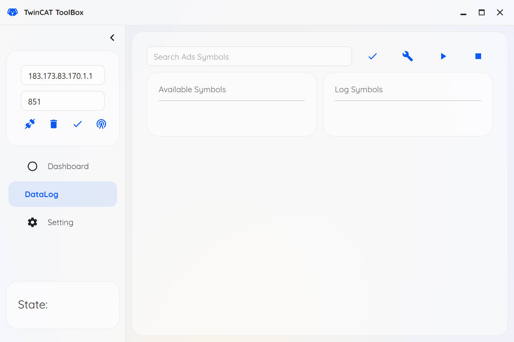
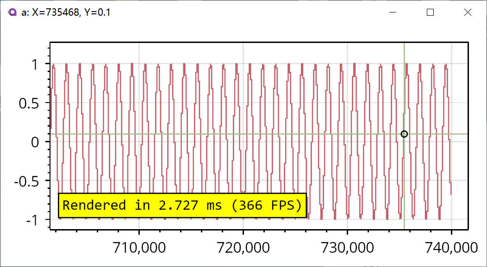
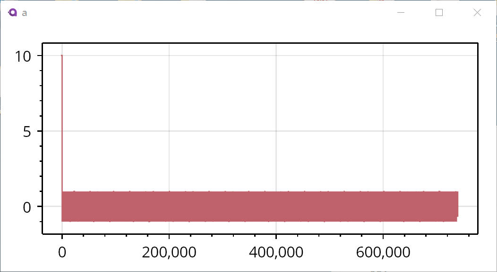

- [中文介绍](doc/README_zh.md)
## TLDR 🌊

Provide a swiss knife for [Beckhoff | New Automation Technology | Beckhoff Worldwide](https://www.beckhoff.com/en-en/) development, main functionalities are listed below:

- [x] connect to the TwinCAT ADS Host
- [x] log and plot the specified symbols with predefined frequency
	- support real-time data log(min 1ms)
	- support real-time data backup
	- support real-time data plot
- [ ] provide a 3rd-party TwinCAT HMI library

## About 😸

This software is modified from [randolfly/LabDataToolbox (github.com)](https://github.com/randolfly/LabDataToolbox), which is mainly used to handle problems in such cases:

1. TwinCAT scope sometimes weirdly causes Windows crash...
2. I want to have a lightweight version of TwinCAT scope 
3. I want to check/modify a symbol value with a nicer UI than default HMI

If you encounter such problems, welcome to try this toolbox!

This toolbox has such characteristics:

1. developed by native language, have small memory usage(about 200MB) and running stable
2. supports comprehensive data acquisition features, including 
	1. visual data selection
	2. real-time data backup
	3. dynamic display of data during the acquisition process
	4. customizable data storage types(`csv` and `mat`)

### Functions Overview 🐶

#### Connection to TwinCAT 🍔

- configuration of TwinCAT ADS connection params
- visual selection of log/plot symbols list(support search selection)
- configuration of log params

#### Real-Time Data Log and Plot 🍟 

> pop up plot data windows

After clicking the "End Data Acquisition" button to complete the data collection, all the data results from the experiment will be displayed. The following is a screenshot of an experimental data set lasting approximately 700 seconds. The interface provides the following functions:
- Left-click and drag: Pan the view
- Middle-click and drag: Zoom the view
- Middle-click: Automatically set the view size
- Right-click: Bring up the menu

Additionally, the log data will be storage to the specified directory, 2 types of log are supported:
- csv
- mat

Temporary data recorded during the operation is stored in `%AppData\Local\TwincatToolbox\tmp`. This data will be automatically deleted after the data recording is completed.

> The software configuration file is: `%AppData\Local\TwincatToolbox\TwincatToolbox.json`.If you need to migrate to a new computer, you can copy this file to transfer the data.

## THANKS

- [AvaloniaUI/Avalonia: Develop Desktop, Embedded, Mobile and WebAssembly apps with C# and XAML. The most popular .NET UI client technology](https://github.com/AvaloniaUI/Avalonia)
- [kikipoulet/SukiUI: UI Theme for AvaloniaUI](https://github.com/kikipoulet/SukiUI)
- [ScottPlot/ScottPlot: Interactive plotting library for .NET](https://github.com/scottplot/scottplot/)
- [Beckhoff Information System - English](https://infosys.beckhoff.com/english.php?content=../content/1033/tc3_adsnetref/7312567947.html&id=)