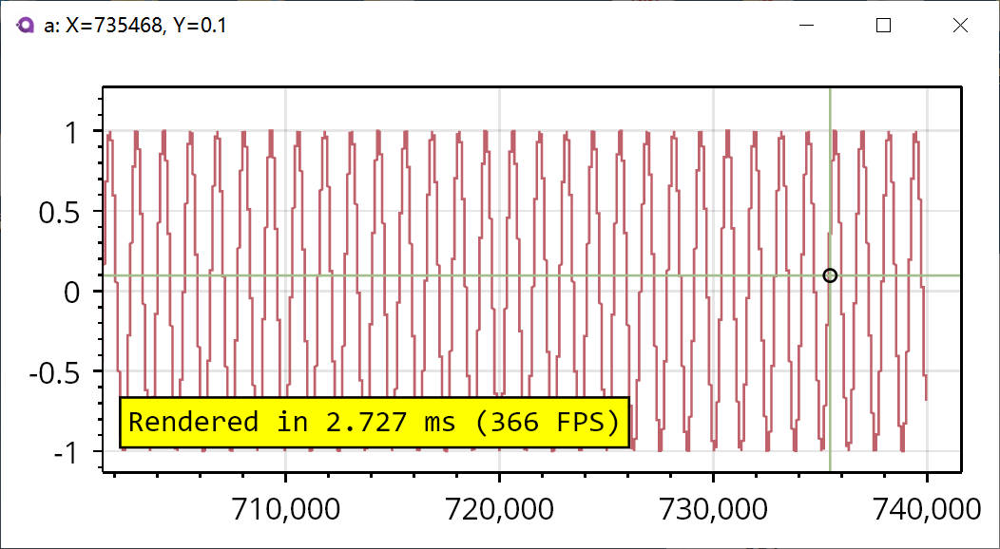

## TLDR 🐱‍👤

提供一个开发[Beckhoff | New Automation Technology | Beckhoff Worldwide](https://www.beckhoff.com/en-en/)的“瑞士军刀”，主要具备下面的功能：

- [x] 连接倍福ADS Host，读写相关变量
- [x] 按照指定频率采集变量数据、实时显示，实时数据备份、支持数据导出
- [ ] 提供一个第三方的倍福界面HMI界面库？

## 关于本项目 😸

本工具箱是在[randolfly/LabDataToolbox (github.com)](https://github.com/randolfly/LabDataToolbox)的基础上进行修改的，主要是为了解决开发倍福程序过程中的以下痛点：

1. 使用scope进行数据记录时偶尔出现==死机==的现象
2. 提供一个相比scope轻量的数据记录软件
3. 想观察某个变量的值，但是不想将其显示在HMI界面上
4. 想修改某个变量的值，但是不想进入倍福的变量监控界面进行修改

如果你也遇见了上面的一系列问题，那么欢迎尝试一下本工具箱！

本工具箱的特点有下面几个方面：

1. 由原生语言开发，占用内存小（约200MB），运行稳定
2. 支持完善的数据采集功能，包含可视化数据选择、实时数据备份、采集过程数据动态显示、自定义数据存储模式等功能
### 功能简介 🐶

#### 连接倍福 🍔

如上图`DataLog`页面提供了一个标准的数据采集操作界面，左侧可以输入倍福 Host 的 AMS NetID 和 Port，并根据配置的连接信息与倍福程序进行通信。

> 在左下角的State转换为Run后才可以获取倍福程序的变量名、并对倍福变量进行数据记录

右侧界面提供了相应的搜索栏，可以通过搜索来过滤无关的变量。在搜索后的变量列表中点击即可选取相应的变量进行数据记录

> 后续提供模糊搜索的功能

数据选取界面中的`Log Symbols`代表进行数据记录的变量。在此列表中被选中的变量将实时显示出来，详细的数据实时显示功能参考下节。

数据记录的参数可以点击扳手按钮进行配置，如下图：

#### 实时数据显示和导出 🍟

点击开始数据采集后会自动弹出窗口实时显示采集的数据，如下图所示。

> 后续可以自动排布窗口位置

完成数据采集后将会展示本次实验所有的数据结果，如下图是一组约700s的实验数据截图，界面中提供下列功能：
- 鼠标左键拖动：平移视图
- 鼠标中键拖动：缩放视图
- 鼠标中键单击：自动设置视图尺寸
- 鼠标右键单击：调出菜单

此外，记录的数据将会自动存储在指定的工作目录下，提供下面两种数据格式：
- csv
- mat

运行过程中的临时数据记录在`%AppData\Local\TwincatToolbox\tmp`下，在数据记录结束后将会自动删除

> 软件配置也保存在`%AppData\Local\TwincatToolbox\TwincatToolbox.json`文件中，如果迁移电脑可以复制该文件来实现数据迁移

## 致谢

- [AvaloniaUI/Avalonia: Develop Desktop, Embedded, Mobile and WebAssembly apps with C# and XAML. The most popular .NET UI client technology](https://github.com/AvaloniaUI/Avalonia)
- [kikipoulet/SukiUI: UI Theme for AvaloniaUI](https://github.com/kikipoulet/SukiUI)
- [ScottPlot/ScottPlot: Interactive plotting library for .NET](https://github.com/scottplot/scottplot/)
- [Beckhoff Information System - English](https://infosys.beckhoff.com/english.php?content=../content/1033/tc3_adsnetref/7312567947.html&id=)